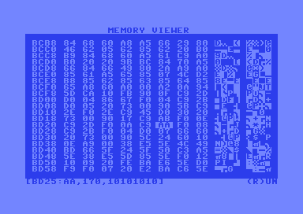

# MemView

A hexadecimal memory viewer and editor for the Commodore 64, written in 6502 assembly language.

## Overview

MemView is a utility that allows you to browse, examine, and edit the contents of your Commodore 64's memory in real-time. It displays memory contents in both hexadecimal and ASCII format, making it useful for debugging, reverse engineering, and understanding how programs use memory.

## Features

- **Hexadecimal Display**: View memory contents as hex bytes in an organized 8-column layout
- **ASCII Representation**: See the ASCII interpretation of memory bytes alongside hex values
- **Navigation Controls**: 
  - Arrow keys for moving through memory pages
  - Plus/minus keys for fine-grained navigation
  - 'G' command for jumping to specific addresses
- **Edit Memory**:
  - 'E' command for entering edit mode
  - Arrow keys for moving around memory on screen
  - See selected address and its current value on the status bar
  - Input hexadecimal values to edit selected address
  - 'R' command to JMP to and run from current selected address
  - Press return key to exit edit mode
- **Real-time Viewing**: Memory contents update dynamically
- **Clean Interface**: Simple, efficient display optimized for the C64's 40x25 screen

## Controls

| Key | Action |
|-----|--------|
| ← → | Navigate left/right by 8 bytes |
| ↑ ↓ | Navigate up/down by one screen |
| + - | Move forwards/backwards by 1 byte |
| G | Go to address (prompts for input) |
| E | Edit byte (← → ↑ ↓ to move then enter hex value) |
| Q | Quit program |
| F1 | Show help message |

## Technical Details

- **Language**: 6502 Assembly (KickAssembler syntax)
- **Target**: Commodore 64
- **Memory Usage**: Minimal footprint, uses zero page locations $C9 and $D1
- **Screen Mode**: Standard text mode (40x25 characters)
